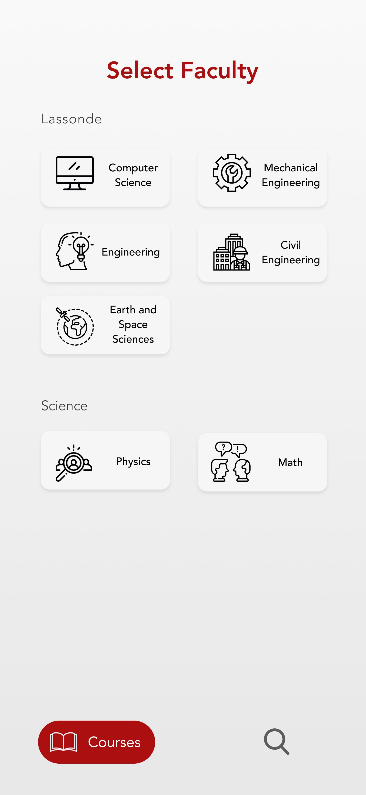
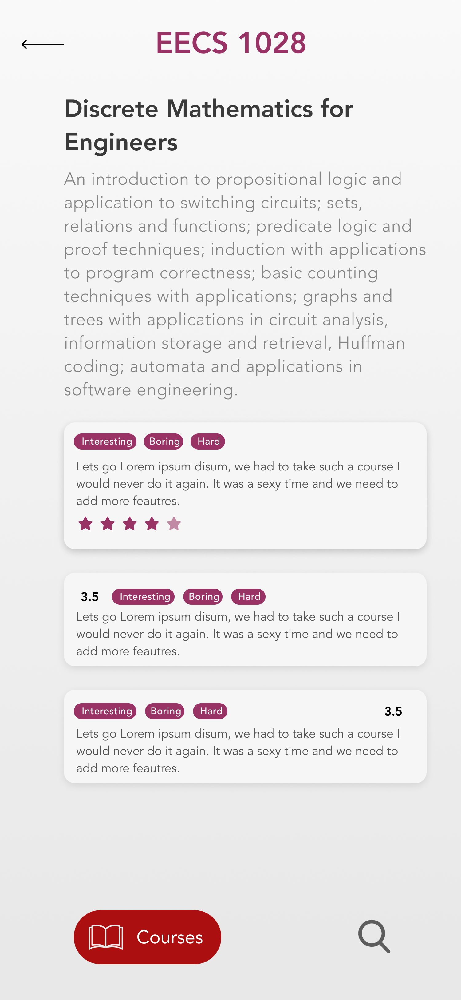

# Review Lassonde


A mobile application for Android/iOS that allows students to talk about their experience with the courses they have taken to help guide future students.

I built the app mainly using [Flutter](https://flutter.dev/), [Firebase](http://firebase.google.com/) and [Selenium](https://selenium-python.readthedocs.io/)

## Getting Started

These instructions will get you a copy of the project up and running on your local machine for development and testing purposes.  

### Flutter Application  

1. Install Flutter. See the [installation guide](https://flutter.io/setup/).

1. Once you clone the repository run `flutter pub get` to install the dependencies.  

1. Use this [guide](https://firebase.google.com/docs/flutter/setup) to connect your app to Firebase.

1. With a connected device you should be able to run the command `flutter run`

### Python WebScraper

> The `course-scrape.py` is highly specific for this case but it does include useful cases to model adding data to firestore while webscraping.

1. Install the [Chrome Driver](https://chromedriver.chromium.org/) in its appropriate location.

1. Setup your Firebase project and update the value of `cred` in `course-scrape.py` with your Firebase config file.

1. Run `course-scrape.py` and you should see progress bars in the command line.

## Screenshots

### [Figma Mockups](https://www.figma.com/file/C0WISDBDmn3TYnB6k50r3s/Experience-Lassonde?node-id=99%3A100)

|    HomePage    |    FacultyPage        | CoursePage  |
| :-------------: |:-------------:| :-----:|
| |  | 

### Flutter


## Built With

- [Flutter](https://flutter.dev/) - Beautiful native apps in record time.
- [Firebase](http://firebase.google.com/) - Firebase is Google's mobile platform that helps you quickly develop high-quality apps and grow your business.
- [Selenium](https://selenium-python.readthedocs.io/) - Selenium automates browsers.

## Helpful Resouces

- [Flutter Fire](https://github.com/FirebaseExtended/flutterfire/tree/master/packages/cloud_firestore/cloud_firestore)
- [Anatomy of Material Buttons in Flutter](https://medium.com/flutterpub/anatomy-of-material-buttons-in-flutter-first-part-40eb790979a6)
- [FlutterIcon - Flutter custom icon generator](https://fluttericon.com/)
- [Flutter Widget In Focus — Chip](https://medium.com/aubergine-solutions/flutter-widget-in-focus-chip-know-it-all-1c46217dca9b)
- [Flutter: Sliders DeMystified](https://medium.com/flutter-community/flutter-sliders-demystified-4b3ea65879c)
- [A Deep Dive Into Flutter TextField](https://medium.com/flutter-community/a-deep-dive-into-flutter-textfields-f0e676aaab7a)
- [Implement searching with Firebase firestore | Flutter](https://medium.com/flutterdevs/implement-searching-with-firebase-firestore-flutter-de7ebd53c8c9)


# License

```license
MIT License

Copyright (c) 2020 Vivek Wadhwani

Permission is hereby granted, free of charge, to any person obtaining a copy
of this software and associated documentation files (the "Software"), to deal
in the Software without restriction, including without limitation the rights
to use, copy, modify, merge, publish, distribute, sublicense, and/or sell
copies of the Software, and to permit persons to whom the Software is
furnished to do so, subject to the following conditions:

The above copyright notice and this permission notice shall be included in all
copies or substantial portions of the Software.

THE SOFTWARE IS PROVIDED "AS IS", WITHOUT WARRANTY OF ANY KIND, EXPRESS OR
IMPLIED, INCLUDING BUT NOT LIMITED TO THE WARRANTIES OF MERCHANTABILITY,
FITNESS FOR A PARTICULAR PURPOSE AND NONINFRINGEMENT. IN NO EVENT SHALL THE
AUTHORS OR COPYRIGHT HOLDERS BE LIABLE FOR ANY CLAIM, DAMAGES OR OTHER
LIABILITY, WHETHER IN AN ACTION OF CONTRACT, TORT OR OTHERWISE, ARISING FROM,
OUT OF OR IN CONNECTION WITH THE SOFTWARE OR THE USE OR OTHER DEALINGS IN THE
SOFTWARE.
```
