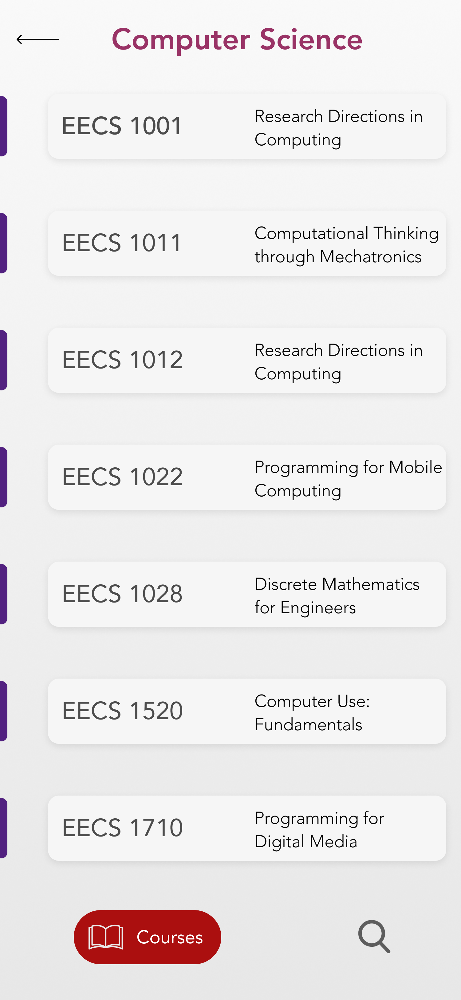

# Review Lassonde

A mobile application for Android/iOS that allows students to talk about their experience with the courses they have taken to help guide future students.

I built the app mainly using [Flutter](https://flutter.dev/), [Firebase](http://firebase.google.com/) and [Selenium](https://selenium-python.readthedocs.io/)

## Getting Started

These instructions will get you a copy of the project up and running on your local machine for development and testing purposes.  

### Flutter Application  

1. Install Flutter. See the [installation guide](https://flutter.io/setup/).

1. Once you clone the repository run `flutter pub get` to install the dependencies.  

1. Use this [guide](https://firebase.google.com/docs/flutter/setup) to connect your app to Firebase.

1. With a connected device you should be able to run the command `flutter run`

### Python WebScraper

> The `course-scrape.py` is highly specific for this case but it does include useful cases to model adding data to firestore while webscraping.

1. Install the [Chrome Driver](https://chromedriver.chromium.org/) in its appropriate location.

1. Setup your Firebase project and update the value of `cred` in `course-scrape.py` with your Firebase config file.

1. Run `course-scrape.py` and you should see progress bars in the command line.

## Screenshots

### [Figma Mockups](https://www.figma.com/file/C0WISDBDmn3TYnB6k50r3s/Experience-Lassonde?node-id=99%3A100)

|    HomePage    |    FacultyPage        | CoursePage  |
| :-------------: |:-------------:| :-----:|
| |  | 

### Flutter

## Built With

- [Flutter](https://flutter.dev/) - Beautiful native apps in record time.
- [Firebase](http://firebase.google.com/) - Firebase is Google's mobile platform that helps you quickly develop high-quality apps and grow your business.
- [Selenium](https://selenium-python.readthedocs.io/) - Selenium automates browsers.

